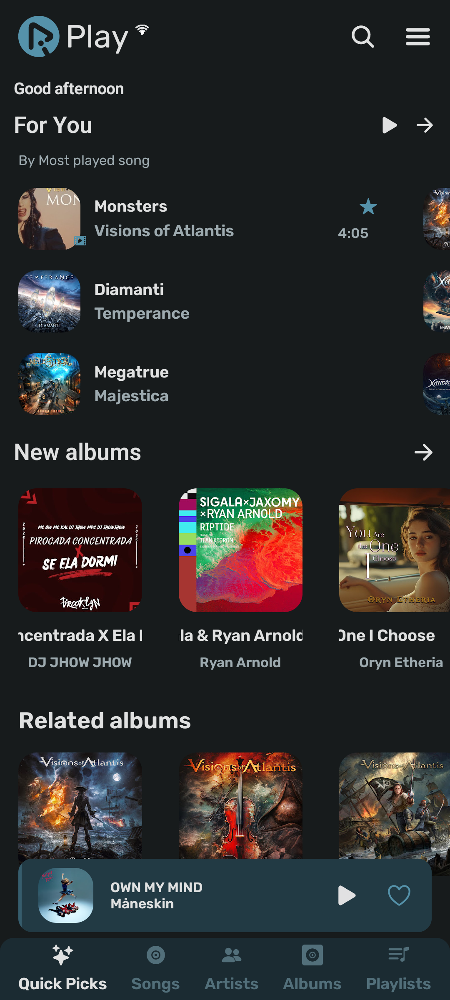
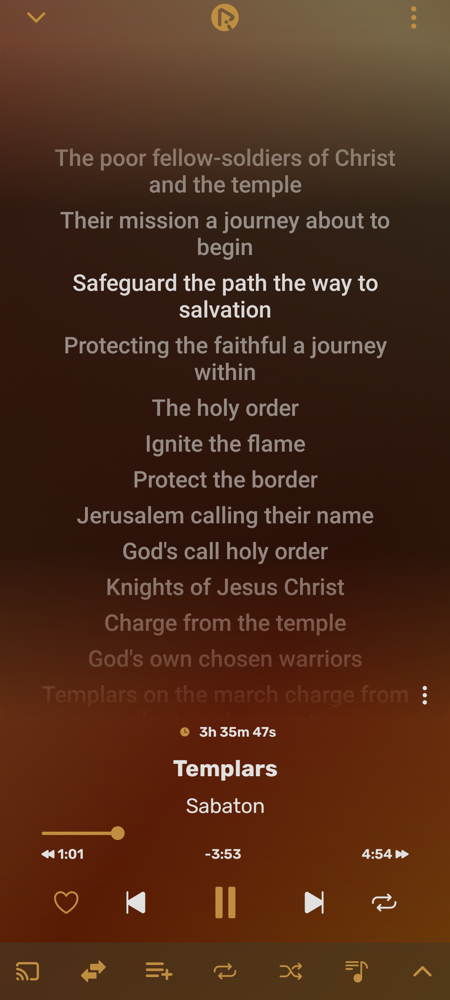
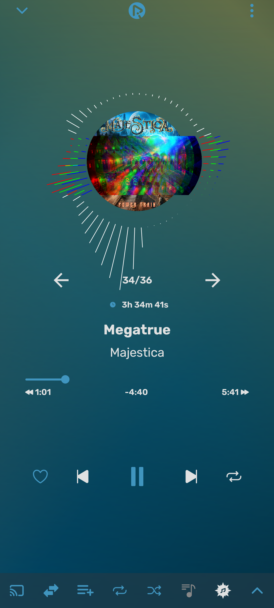
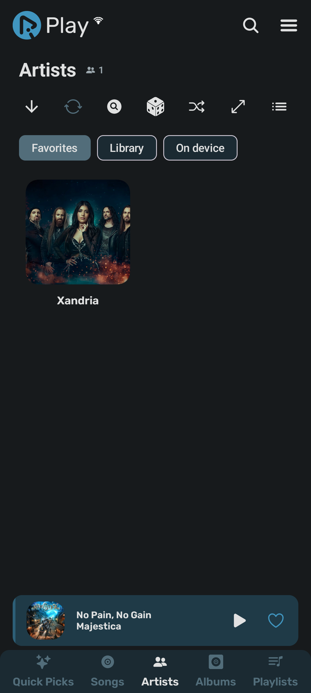
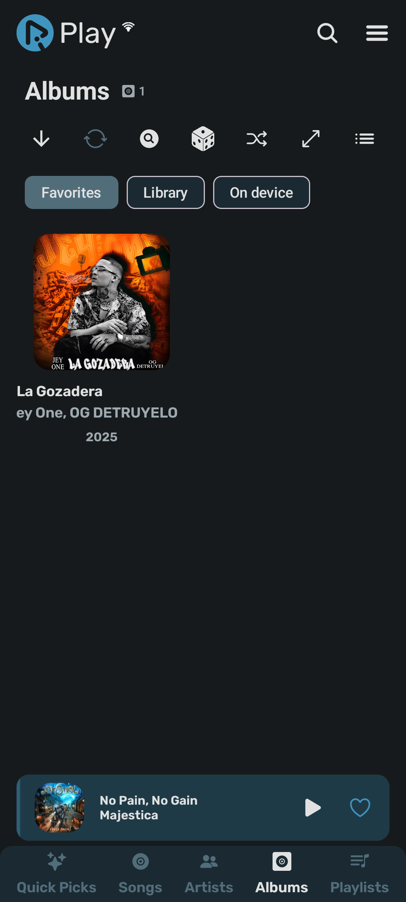
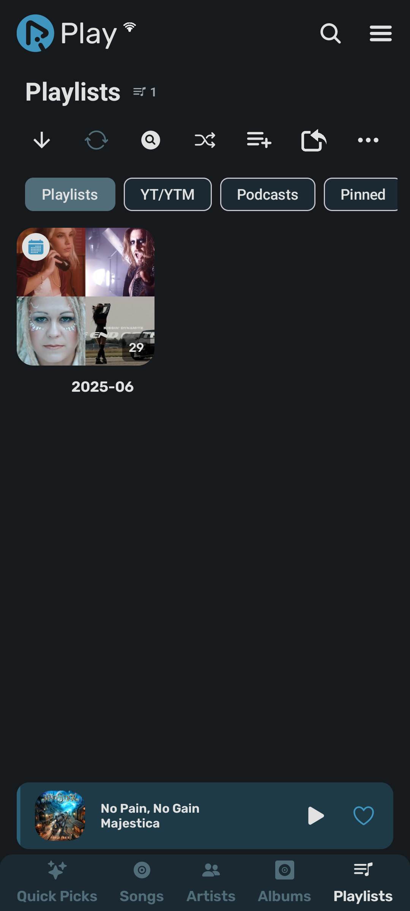
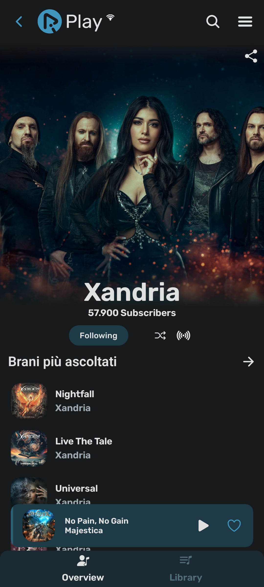
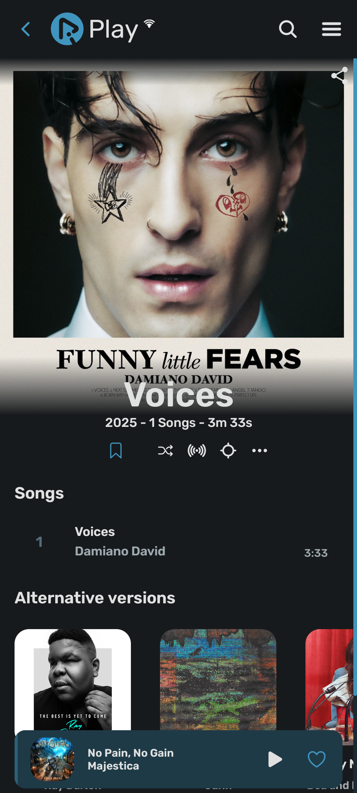
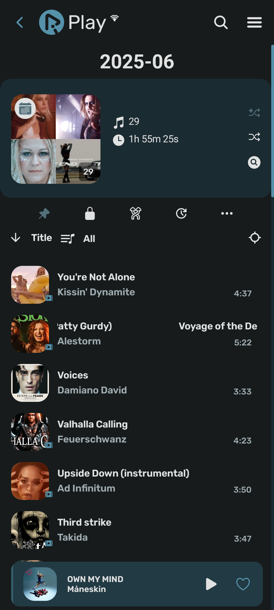

        
  
<b>RiPlay</b> is a multiplatform music player, customizable at will

## ❗ Disclaimer
RiPlay:
- <b>does <b>not collect any data</b>.</b>
- <b>does <b>not include online content download, cache or background playback</b> functionality</b>
- For online content use Youtube Player library as a wrapper around the official [IFrame Player API](https://developers.google.com/youtube/iframe_api_reference), which runs inside of a WebView.

Therefore there are <b>no issues with YouTube Terms of Service</b>
.

## ✨ Features
- **Multilingual:** English, Italian, German, Russian, French, Spanish, Czech, Turkish, Romanian and more. Contributions for other languages are welcome
- Play offline and online songs, videos, artists, albums, playlists, podcasts
- Multiple mixed queues, can contain audio or video or both
- Listening statistics
- Audio visualizer on player with many type of effects.
  - THIS FEATURE REQUIRES MIC PERMISSION, ONLY AVAILABLE IF ACTIVATED FROM SETTINGS. [Full list of permissions](https://github.com/fast4x/RiPlay/wiki/FAQs#what-permissions-are-used)
- News, mood, musical genres, new albums from favourite artists
- Import/Export online, RiPlay playlists, can share with friend all RiPlay playlists
- Fetch, display, edit, translate synchronized, or not, songs lyrics
- Customizable themes
- Sleep timer with customizable time
- Audio control: volume app, device, playback speed, pitch, normalization, skip silence, bassboost
- Support Android Auto only for offline songs
- Support Android TV (experimental)
- Support Widgets (experimental)
- Check for Updates, which can be enabled or disabled in settings

## 📷 Screenshots

  
  
  
  
  
  
  
  
  
  

## 🌐 Languages available
- **Afrikaans** thanks to [HelloZebra1133](https://crowdin.com/profile/HelloZebra1133)
- **Arabic:** thanks to [ABS zarzis](https://crowdin.com/profile/abszar), [Ahmad Al Juwaisri](https://crowdin.com/profile/juwaisri)
- **Azerbaijani** thanks to [Nizami Səmidov](https://crowdin.com/profile/nizamismidov4), [Notesuree](https://github.com/Notesuree)
- **Bangla:** thanks to [Ann Naser Nabil](https://github.com/AnnNaserNabil)
- **Bashkir:** thanks to [Shilave malay](https://crowdin.com/profile/Bash.boy)
- **Basque:** thanks to [iazkue](https://github.com/iazkue)
- **Catalan:** thanks to [Adrià Martínez](https://crowdin.com/profile/marxally), [Aniol](https://crowdin.com/profile/aniol), [EMC_Translator](https://crowdin.com/profile/EMC_Translator)
- **Chinese Simplified:** thanks to [benhaotang](https://crowdin.com/profile/benhaotang), [SharkChan0622](https://github.com/SharkChan0622)
- **Chinese Traditional:** thanks to [YeeTW](https://github.com/yjcTW), [SharkChan0622](https://github.com/SharkChan0622)
- **Czech:** thanks to [ikanakova](https://github.com/ikanakova), [JZITNIK-github](https://github.com/JZITNIK-github)
- **Danish** thanks to [cultcats](https://crowdin.com/profile/cultcats)
- **Dutch:** thanks to [BabyBenefactor](https://crowdin.com/profile/BabyBenefactor)
- **English:** thanks to [Alejandro Moctezuma](https://crowdin.com/profile/alejandromoc), [twistios](https://crowdin.com/profile/twistios), [Smk90](https://crowdin.com/profile/smk90), [CanIn](https://crowdin.com/profile/canin), [koliwan](https://crowdin.com/profile/koliwan), [Glich440](https://github.com/Glich440), [fast4x](https://github.com/fast4x)
- **Esperanto:** thanks to [kefiiris](https://github.com/kefiiris)
- **Estonian** thanks to [beez276](https://crowdin.com/profile/beez276)
- **Filipino** thanks to [Clyde-Timonera](https://github.com/Clyde-Timonera)
- **Finnish:** thanks to [Smk90](https://crowdin.com/profile/smk90), [rikalaj](https://crowdin.com/profile/rikalaj)
- **French:** thanks to [Mickael81](https://crowdin.com/profile/mickael81), [esophagusdecency](https://crowdin.com/profile/esophagusdecency), [Mickael81](https://github.com/Mickael81), [NEVARLeVrai](https://github.com/NEVARLeVrai)
- **Galician:** thanks to [zordor](https://crowdin.com/profile/zordor), [ninjum](https://crowdin.com/profile/ninjum)
- **German:** thanks to [twistqj](https://crowdin.com/profile/twistqj), [nitro4542](https://crowdin.com/profile/nitro4542), [twistios](https://crowdin.com/profile/twistios), [materialred](https://crowdin.com/profile/materialred), [OlimitLolli](https://crowdin.com/profile/OlimitLolli), [Lolozweipunktnull](https://crowdin.com/profile/Lolozweipunktnull), [Seryoga1984](https://crowdin.com/profile/Seryoga1984), [Conk](https://crowdin.com/profile/conk), [siggi1984](https://github.com/siggi1984)
- **Greek:** thanks to [Marinkas](https://github.com/Marinkas)
- **Hebrew:** thanks to [opcitgv](https://crowdin.com/profile/opcitgv), [TheCreeperDuck](https://crowdin.com/profile/thecreeperduck)
- **Hindi:** thanks to [NikunjKhangwal](https://crowdin.com/profile/nikunjkhangwal), [Sharunkumar](https://crowdin.com/profile/sharunkumar), [Th3-C0der](https://github.com/Th3-C0der)
- **Hungarìan:** thanks to [Zan1456](https://crowdin.com/profile/Zan1456), [Ndvok](https://crowdin.com/profile/ndvok)
- **Italian:** thanks to [Fabio Iotti](https://crowdin.com/profile/bruce965), [agefcgo](https://crowdin.com/profile/agefcgo), [CiccioDerole](https://crowdin.com/profile/CiccioDerole), [fast4x](https://github.com/fast4x)
- **Indonesian:** thanks to [luthfialfarabi](https://crowdin.com/profile/luthfialfarabi), [teddysulaimanGL](https://github.com/teddysulaimanGL), [Fausta Ahmad](https://crowdin.com/profile/faustaahmad)
- **Interlingua** thanks to [softinterlingua](https://github.com/softinterlingua)
- **Japanese:** thanks to [maboroshin](https://crowdin.com/profile/maboroshin), [Mid_Vur_Shaan](https://crowdin.com/profile/Mid_Vur_Shaan)
- **Malayalam** thanks to [chayotic](https://github.com/chayotic), [XDreamist](https://crowdin.com/profile/xdreamist)
- **Korean:** thanks to  [ZeroZero00](https://crowdin.com/profile/ZeroZero00), [TsyQax](https://crowdin.com/profile/TsyQax)
- **Norwegian:** thanks to [Xyrcon](https://crowdin.com/profile/xyrcon)
- **Odia:** thanks to [redpanda9348](https://crowdin.com/profile/redpanda9348), [Get100percent](https://github.com/Get100percent)
- **Persian:** thanks to [CUMOON](https://github.com/CUMOON)
- **Polish:** thanks to [Krzysztof](https://crowdin.com/profile/scrummybingus), [severitysingular](https://crowdin.com/profile/severitysingular), [Zduniusz](https://crowdin.com/profile/zduniusz), [AntoniNowak](https://crowdin.com/profile/AntoniNowak), [roklc](https://github.com/roklc), [Adam Kop](https://crowdin.com/profile/damianadam000)
- **Portuguese:** thanks to [Juan Ignacio Tejera](https://crowdin.com/profile/originaljuani), [ManuelCoimbra](https://crowdin.com/profile/ManuelCoimbra), [NEVARLeVrai](https://github.com/NEVARLeVrai)
- **Portuguese, Brazilian:** thanks to [vs-machado](https://crowdin.com/profile/vs-machado), [luxdev01](https://crowdin.com/profile/luxdev01), [VitoriaLima1802](https://crowdin.com/profile/vitorialima1802), [xSyntheticWave](https://crowdin.com/profile/xSyntheticWave), [RegularWater](https://crowdin.com/profile/RegularWater), [NEVARLeVrai](https://github.com/NEVARLeVrai)
- **Romanian:** thanks to [OrangeZXZ](https://github.com/OrangeZxZ)
- **Russian:** thanks to [Michael Müller](https://crowdin.com/profile/xqzme1337), [HighMode](https://crowdin.com/profile/highmode), [koliwan](https://crowdin.com/profile/koliwan), [Nebula-Mechanica](https://crowdin.com/profile/Nebula-Mechanica), [Alnoer](https://crowdin.com/profile/Alnoer), [kptmx](https://crowdin.com/profile/kptmx), [Crayz310](https://github.com/Crayz310), [Vladimir](https://crowdin.com/profile/vladimir15426), [@siggi1984](https://github.com/siggi1984)
- **Serbian (Cyrillic, Latin)** thanks to [IvanMaksimovic77](https://github.com/IvanMaksimovic77)
- **Spanish:** thanks to [MS-PC](https://crowdin.com/profile/ms-pc), [Alejandro Moctezuma](https://crowdin.com/profile/alejandromoc), [Juan Ignacio Tejera](https://crowdin.com/profile/originaljuani), [iOSStarWorld](https://crowdin.com/profile/iosstarworld), [Corotyest](https://crowdin.com/profile/corotyest), [DanielSevillano](https://github.com/DanielSevillano), [Fabian Urra](https://crowdin.com/profile/nsagcl)
- **Sinhala:** thanks to [VINULA2007](https://crowdin.com/profile/VINULA2007)
- **Swedish:** thanks to [sebbe.ekman](https://crowdin.com/profile/sebbe.ekman), [Dženan](https://crowdin.com/profile/Dženan)
- **Tamil** thanks to [Vignesh-p-s](https://crowdin.com/profile/vignesh-p-s)
- **Turkish:** thanks to [LinuxUsersLinuxMint](https://github.com/LinuxUsersLinuxMint), [abfreeman](https://github.com/abfreeman), [2010furs](https://github.com/2010furs), [Muha Aliss](https://crowdin.com/profile/muhaaliss)
- **Telugu** thanks to [SureshTimma](https://crowdin.com/profile/sureshtimma)
- **Ukrainian:** thanks to [Avin](https://crowdin.com/profile/avinateachip), [Michael Müller](https://crowdin.com/profile/xqzme1337), [NiXT0y](https://crowdin.com/profile/nixt0y), [Crayz310](https://github.com/Crayz310)
- **Vietnamese:** thanks to [teaminh](https://crowdin.com/profile/teaminh)

## 📲 Installation

<!--

[](https://apps.obtainium.imranr.dev/redirect?r=obtainium://app/%7B%22id%22%3A%22it.fast4x.rimusic%22%2C%22url%22%3A%22https%3A%2F%2Fgithub.com%2Ffast4x%2Frimusic%22%2C%22author%22%3A%22fast4x%22%2C%22name%22%3A%22RiMusic%22%2C%22preferredApkIndex%22%3A0%2C%22additionalSettings%22%3A%22%7B%5C%22includePrereleases%5C%22%3Afalse%2C%5C%22fallbackToOlderReleases%5C%22%3Atrue%2C%5C%22filterReleaseTitlesByRegEx%5C%22%3A%5C%22%5C%22%2C%5C%22filterReleaseNotesByRegEx%5C%22%3A%5C%22%5C%22%2C%5C%22verifyLatestTag%5C%22%3Afalse%2C%5C%22dontSortReleasesList%5C%22%3Afalse%2C%5C%22useLatestAssetDateAsReleaseDate%5C%22%3Afalse%2C%5C%22trackOnly%5C%22%3Afalse%2C%5C%22versionExtractionRegEx%5C%22%3A%5C%22%5C%22%2C%5C%22matchGroupToUse%5C%22%3A%5C%22%5C%22%2C%5C%22versionDetection%5C%22%3Atrue%2C%5C%22releaseDateAsVersion%5C%22%3Afalse%2C%5C%22useVersionCodeAsOSVersion%5C%22%3Afalse%2C%5C%22apkFilterRegEx%5C%22%3A%5C%22%5C%22%2C%5C%22invertAPKFilter%5C%22%3Afalse%2C%5C%22autoApkFilterByArch%5C%22%3Atrue%2C%5C%22appName%5C%22%3A%5C%22%5C%22%2C%5C%22shizukuPretendToBeGooglePlay%5C%22%3Afalse%2C%5C%22allowInsecure%5C%22%3Afalse%2C%5C%22exemptFromBackgroundUpdates%5C%22%3Afalse%2C%5C%22skipUpdateNotifications%5C%22%3Afalse%2C%5C%22about%5C%22%3A%5C%22RiMusic%20is%20a%20multilingual%20Android%20application%20for%20streaming%20music%20from%20YouTube%20Music.%20It%20began%20as%20an%20extension%20of%20ViMusic%2C%20then%20acquired%20its%20own%20identity.%20It%20allowing%20the%20user%20to%20customize%20it%20at%20will.%5C%22%7D%22%2C%22overrideSource%22%3Anull%7D)

-->

## ❓ FAQs
- [Wiki page FAQs](https://github.com/fast4x/RiPlay/wiki/FAQs)
- [Group on Telegram ](https://t.me/riplay_app)
- [Community on Reddit](https://www.reddit.com/r/RiMusicApp/)

## 🤝 Contributing
**Pull requests are welcome if you accept t distribute your code with GPL3.0 license**
- If you accept GPL license, you can:
  - **develop new functions** or **fix a bug**, fork the repository, send a pull request.
  - **translate** or **improve a translation** read the section Translations

### 🔤 Translations
- Go to [Crowdin](https://crwd.in/rimusic/37f0755f4e2cf99351844c27c86df0f12540778), help with the translations.

## 🫂 Acknowledgments
- [**RiMusic**](https://github.com/fast4x/RiMusic) and all contributors
- [**ViMusic**](https://github.com/vfsfitvnm/ViMusic)
- **RiPlay current Logo Design from** [jaimtres](https://github.com/jaimtres)
- **RiPlay previous Logo, many current icons from** [@ikanakova](https://github.com/ikanakova)
- **RiPlay New player, lyrics layouts from** [aneesh1122](https://github.com/aneesh1122)
- [**Android Youtube Player**](https://github.com/PierfrancescoSoffritti/android-youtube-player): YouTube Player library for Android and Chromecast, stable and customizable.
- [**YouTube Internal Clients**](https://github.com/zerodytrash/YouTube-Internal-Clients): A python script that discovers hidden YouTube API clients. Just a research project.
- [**Ionicons**](https://github.com/ionic-team/ionicons): Premium hand-crafted icons built by Ionic, for Ionic apps, web apps everywhere.
- [**FlatIcon.com**](https://www.flaticon.com/): Download Free Icons, Stickers for your projects. Resources made by, for designers.
- [**Translator**](https://github.com/therealbush/translator): A simple, free Google Translate library for Kotlin/JVM, Java.
- [**KuGou**](https://www.kugou.com): Lyrics provider
- [**LrcLib**](https://lrclib.net): Lyrics provider
- [**HypnoticCanvas**](https://mikepenz.github.io/HypnoticCanvas/): A shader modifier for Compose Multiplatform / Jetpack Compose

